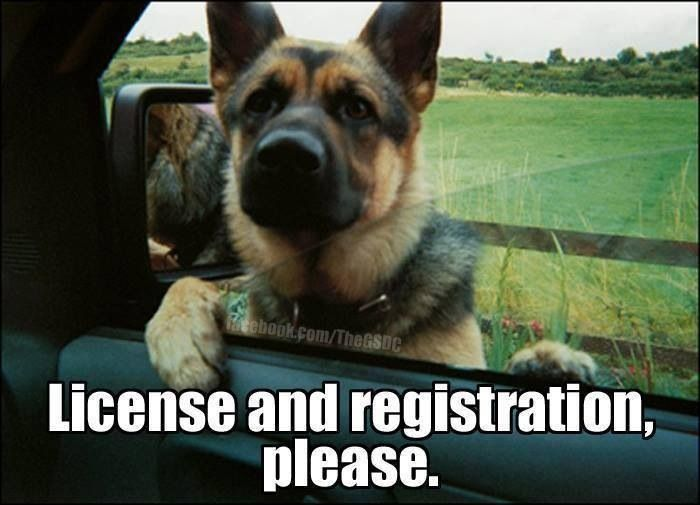

# License Cop

A nifty script that fetches the licenses for all your third-party libraries.



## System Requirements

You will need:

- Python 3.6 or better
- Pipenv (The official Python dependency manager, similar to npm or Bundler)

### Installing Pipenv

It's advisable to [install Pipenv locally](http://docs.python-guide.org/en/latest/dev/virtualenvs/#installing-pipenv),
but in most systems installing it system-wide should work just fine. If you're
using a homebrewed macOS:

```sh
$ pip3 install pipenv
```

Make sure your shell profile (eg: `~/.profile` or `~/.bash_profile`) exports the
following environment variables, otherwise Pipenv will not work:

```sh
export LC_ALL=en_US.UTF-8
export LANG=en_US.UTF-8
```

### The `GITHUB_TOKEN` environment variable

You need to have a valid
[GitHub personal access token](https://help.github.com/articles/creating-a-personal-access-token-for-the-command-line/)
with enough permissions to read the repositories you want.

This token needs to be exported to the `GITHUB_TOKEN` environment variable.

## Running License Cop

Once everything is set, run the `./license-cop` script. It will print
its usage instructions.

## Running Tests

We use [pytest](https://docs.pytest.org/en/latest/) to execute our automated
test suite, which is installed by Pipenv.

To run the entire test suite, just invoke the `./test.sh` script.
